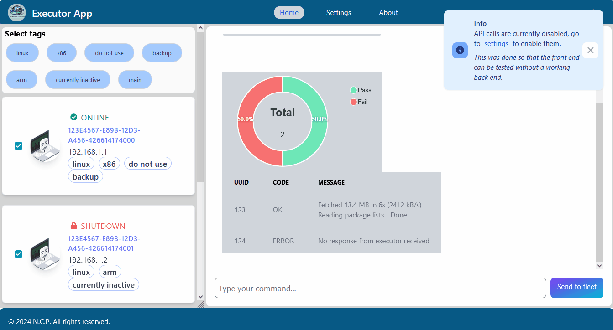
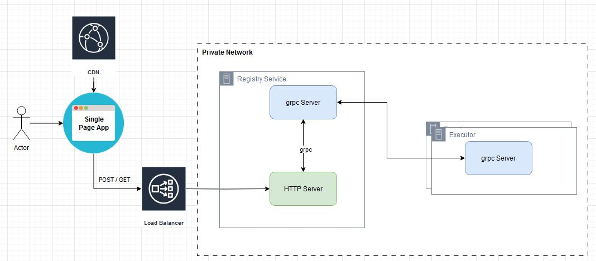

# Executor App 


Welcome to the Executor App project! The purpose of this project is to showcase my frontend and backend development skills. The use case is straightforward: executing commands on a fleet of hosts, which I refer to as 'executors'.

## Table of Contents

- [Architecture](#architecture)
- [Development Workflow](#development-workflow)
- [Usage](#usage)
- [License](#license)
- [Contact](#contact)

## Architecture


The image above illustrates the general architecture, consisting of a single-page static web application, the registry service, and a fleet of executors. The webpage is intended to be served via a CDN and should interact with the registry service-provided REST API through a load balancer

**Note**</br>
The architecture is designed with the assumption that we have full freedom in accessing the private network. I designed the executor to operate with static IP addresses and specific ports under our control. This was an intentional design choice to ensure security and control, avoiding the creation of a Remote Access Tool (RAT) or any malicious software.

- Registry Service: Responsible for registering, unregistering, and forwarding requests to the executor fleet via gRPC. Additionally, the registry service exposes a REST API for communication with the frontend.

- Executors: These run commands received from the registry service.

## Development Workflow
<p align="center">
  <.img src="./.img/dev%20workflow.jpg" alt="Image showing the development workflow">
</p>
The development workflow begins with the .proto files located in the `./backend/proto` folder. The protoc generator is then used to create the Go `*.pb.go` and `*.gw.go` service definitions. Additionally, protoc is used to generate a `*.yml` file containing the Swagger REST API definition. This YAML file is utilized in the `./frontend` project for generating types for REST API calls. This approach ensures that the types are automatically generated based on the `.proto` service definitions, providing consistency and reducing manual work.

The following example shows a rpc procedure from the registry service which will be expoesed via a HTTP server: 
```
    rpc RemoteExecuteCmd(RemoteExecuteCmdRequest) returns (RemoteExecuteCmdResponse) {
      option (google.api.http) = {
        post: "/v1/cmd"
        body: "*"
      };
    }
```

## Usage
1. Run the registry server:
```sh
main --registryMode
```

2. Run the executor servers, pass the ip and port of the registry service:
```sh
main --registryGrpcAddr <IP:PORT>
```
3. Navigate to the frontend: `./frontend/build/index.html`.

## License

This project is licensed under the MIT License. 

## Contact

For questions, please reach out.